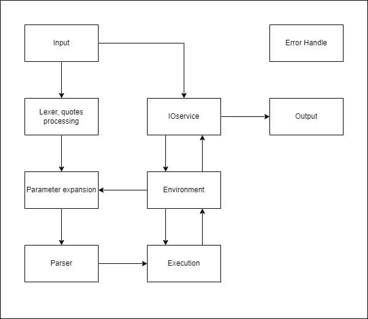
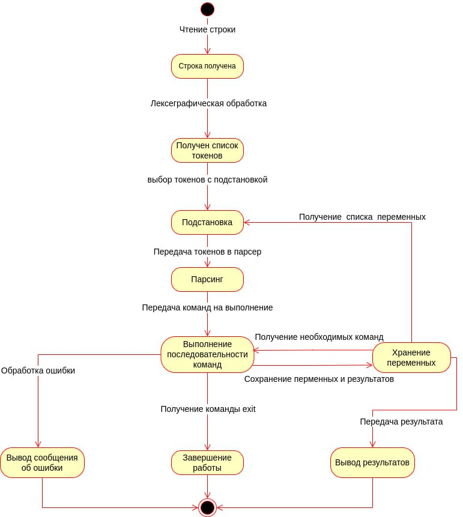

# Диаграмма классов

# Диаграмма состояний

# Описание

## Input
Построчный ввод поступающий в программу.
1. Команда или пайп (строка).
2. Ввод во время исполнения команды (последовательность строк).

## Lexer --- разделение ввода по символам `|` и осуществление подстановок.

Подстановка: `$имя_переменной`, где `имя_переменной` --- `w+` (непустая последовательность букв (по умолчанию латинский алфавит) или цифр).

`input`: `string` - строка (ввод пользователя) \
`output`: `[string]` - массив строк (каждая строка отдельная команда, вместе --- последовательность команд).

Lexer последовательно проходит по `input`, записывает пройденные символы в `buffer` --- текущая прочитанная строка.

### Состояния Lexer'а: 
- `Start`, начальное состояние;
- `Single quote (SQ)`, открыта одинарная кавычка;
- `Double quote (DQ)`, открыта двойная кавычка;
- `BS`, предыдущий символ `\` --- символ экранирования (любой другой символ после него теряет свой синтаксический смысл).
- `Dollar`, началась подстановка;
- `Dollar in Double quote (Dollar & DQ)`, началась подстановка внутри двойных кавычек;
- `BS in Double quote (BS & DQ)`, предыдущий символ `\` в двойных кавычках.

### Состояние `start`.
- Если встретили '|', то совершаем следующее действие: добавляем `buffer` в `output` (без `|`), отчишаем `buffer`, остаёмся в этом же состоянии.
- Символ `'` --- переход в `SQ`.
- Символ `"` --- переход в `DQ`.
- Символ `\` --- переход в `BS`.
- Символ `$` --- переход в `Dollar`.
- Любой другой символ --- остаёмся в этом же состоянии.

### Состояние `SQ`.
- Если встретили символ `'`, то переходим в `Start`.
- Любой другой символ --- остаёмся в этом же состоянии.

### Состояние `DQ`.
- Если встретили символ `"`, то переходим в `Start`.
- Символ `$` --- переход в `Dollar & DQ`.
- Символ `\` --- переход в `BS & DQ`.
- Любой другой символ --- остаёмся в этом же состоянии.

### Состояние `BS`.
- Любой символ --- переходим в `Start`.

### Состояние `Dollar`.
В этом состянии записываем пройденные символы не в `buffer`, а в `var` (`$` никуда не записываем).
- Если встретили `w` (буква или цифра) --- остаёмся в этом же состоянии.
- Любой другой символ --- если `var` пустая строка, то записываем в `buffer` символ `$`, иначе записываем в `buffer` строку `Environment[var]` (значение переменной `var` хранящееся в окружении; операцией присваивания должно гарантироваться, что в этом значении все символы, имеющие синтаксический смысл, экранированы символом `\`), отчищаем `var`. 
В любом случае после этих действий переходим в `Start`, при этом продолжаем чтение с того же символа (не двигаемся по `input`).

### Состояние `Dollar & DQ`.
Это состояние аналогично состоянию `Dollar`, только переходим не в `Start`, а в `DQ`.

### Состояние `BS & DQ`.
Это состояние аналогично состоянию `BS`, только переходим не в `Start`, а в `DQ`.

### Конечных состояний два (когда прочитали весь `input`):
- `Start` --- добавляем `buffer` в `output`, возвращаем `output`.
- `Dollar` --- совершаем действие, как если бы встретили любой символ кроме `w`.

Если строка закончилась в любом другом состоянии, то !ошибка разбиения по `|`!.

Пример валидного `input`: \
`   ` \
`echo a` \
`echo '"' | echo b "'"` \
`echo \| | echo \'` \

Пример невалидного `input`: \
`echo "a | echo b` \
`echo 'abc` \
`echo \`

## Parser --- разбивает команды на слова.
Слово --- это последовательность непробельных символов (`s`), или последовательность символов, заключённых в кавычки, или экранированный пробельный символ (`\ `), или комбинация этих последовательностей (кавычки удаляются из строки). 
Первое слово --- имя команды, следующие --- её аргументы. 
За исключением команды присваивания, которая имеет вид `w+=*`, имя команды в таком случае --- это символ `=`, первый аргумент `w+` (последовательность букв или цифр левее `=`, имя переменной), второй аргумент `*` (всё, что правее `=`, значение переменной).

`input` --- массив строк (команд). \
`output` --- массив структур вида: строка (`name` --- имя команды), массив строк (`args` --- аргументы команды).

Parser последовательно проходится по каждой строке `input` и записывает пройденные символы в `buffer`.

### Состояния Parser`а:
- `Empty` --- начальное состояние, слово ещё не началось.
- `Var word (VW)` --- началось слово, которое может быть именеме переменной.
- `Regular word (RW)` --- началось обычно слово.
- `Single quote (SQ)`, открыта одинарная кавычка;
- `Double quote (DQ)`, открыта двойная кавычка;
- `BS`, предыдущий символ `\`;
- `BS in Double quote (BS & DQ)`, предыдущий символ `\` в двойных кавычках.

### Состояние `Empty`:
- Если встретили пробельный символ (`s`), то остаёмся в этом же состоянии, не записываем в `buffer` этот символ.
- Если встретили букву или цифру (`w`) и это первое слово в этой команде, то переходим в состояние `VW`.
- Любой другой символ --- переходим в состояние `RW`.

### Состояние `VW`:
- Если встретили букву или цифру (`w`), то остаёмся в этом же состоянии.
- Символ `=` --- записываем в `name` символ `=`, добавляем в `args` строку `buffer`, потом строку из всего, что после текущего символа, завершаем разбор текущей команды.
- Любой другой символ --- переходим в состояние `RW`, не записываем в `buffer` этот символ, продолжаем чтение с него же.

### Состояние `RW`:
- Если встретили пробельный символ, то если это первое слово, то в `name` записываем `buffer`, иначе добавляаем в `args` строку `buffer`.
В любом случае отчищаем `buffer`, переходим в состояние `Empty`.
- Символ `'` --- не добавляем в `buffer`, переход в `SQ`.
- Символ `"` --- не добавляем в `buffer`, переход в `DQ`.
- Символ `\` --- не добавляем в `buffer`, переход в `BS`.
- Любой другой символ --- остаёмся в этом же сосотянии.

### Состояние `SQ`.
- Если встретили символ `'`, не добавляем его в `buffer`, переходим в `RW`.
- Любой другой символ --- остаёмся в этом же состоянии.

### Состояние `DQ`.
- Если встретили символ `"`, то недобавляем его в `buffer`, переходим в `RW`.
- Символ `\` --- не добавляем в `buffer`, переход в `BS & DQ`.
- Любой другой символ --- остаёмся в этом же состоянии.

### Состояние `BS`.
- Любой символ --- переходим в `RW`.

### Состояние `BS & DQ`.
- Любой символ --- переходим в `DQ`.

### Конечных состояний два (когда прочитали весь всю строку):
- `RW` --- Совершаем действие, как если бы встретили пробельный символ.
- `Empty` --- заканчиваем разбор команды.

Если строка закончилась в любом другом состоянии, то !ошибка разбиения на комнды!.

## Execution
Принимает массив `Command`.

Для каждого элемента массива последовательно (в порядке выполения команд) ищет имя команды в словаре `__commands` в `Environment` и вызывает
соответствующею команду с переданными аргументами. Если команда не была найдена, то пытается вызвать внешнюю программу с теми же аргументами.

Если исполняемой командой является команда присваивания `=`, то все спецсимволы второго аргумента (т.е. присваемого значения) экранируются знаком `\`.

Если не было найдено ни встроенной команды, ни внешней программы, то выводим ошибку пользователю и ждем ввода следующей команды.

## Environment
Словарь `__variables`: `<Имя_переменной>` -> `<Значение переменной>` (строка) \
Словарь `__commmands`: `<Имя_команды>` -> `<Объект/функция/указатель/идентификатор для вызова команды>` \
Результат выполения последней команды и ее код возврата 

## IOService
Представляет собой прослойку для взаимодействия консоли и выполняемых программ с пользователем. \
Дает доступ к потокам ввода/вывода

## Output
Вывод консоли

## Error handler
Обрабатывает ошибки выполнения консоли, команд и программ.
Может осуществлять логгирование.

# Фаза 1 

Лексер не обрабатывает пайпы `|`, считает что в полученной строке только одна команда. \
Подстановки и операция присваивания не обрабатываются, выполняются только именные внутренние команды и вызываются внешние программы.

# Фаза 2

Полная функциональность в соответстии с ТЗ.
