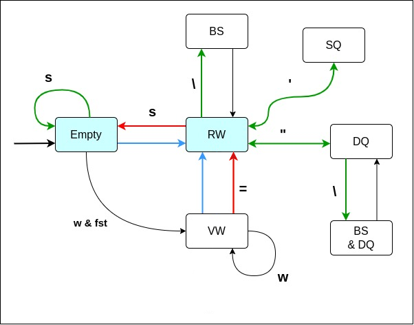

# CLI bash-like интерпретатор

Программа представляет собой интерпретатор командной строки. Интерпретатор построчно до символа новой строки считывает команды пользователя и выполняет их. Программа работает с графическими символами ASCII. При использовании программы с символами из других кодировок ее поведение не определено.  

Подробнее о командах, введенных пользователем, и примерах их использования см. ниже. 

Потоки ввода-вывода всей программы задаются в ее аргументах при запуске. Если они не заданы, то потоки ввода-вывода берутся по умолчанию: `stdin`, `stdout`, `stderr`. 

## 1. Главный цикл


Основной принцип работы программы построен на главном цикле, состоящем из следующих этапов:
1. Ввод пользователем строки с командами.
2. Лексическая обработка - обработка одинарных и двойных кавычек, разбиение пайплайна на последовательность команд, подстановка переменных.
3. Парсинг - разбиение каждой команды на слова.
4. Выполнение команд. 

_Команда_ - введенная пользователем строка, разделенная пайпами. У команды есть ее имя и аргументы, представляющие собой строки. Что является пайпом, а что просто символом `|` см. ниже в описании этапа лексической обработки. 

Определение термина _слово_ см. в описании этапа парсинга.

### 1.1. Ввод строки пользователя
Получение очередного ввода пользователя включает в себя вывод приглашения пользователя на ввод в виде `> ` и считывание введенной пользователем строки после приглашения из ввода. Строка считывается до символа перевода строки, после чего проводится ее синтаксический анализ и выполнение команд из нее.

### 1.2. Lexer - разделение ввода по символам `|` и осуществление подстановок

Подстановка: `$имя_переменной`, где `имя_переменной` - `w+` (непустая последовательность букв (по умолчанию латинский алфавит) или цифр).

`input`: `string` - строка (ввод пользователя) \
`output`: `vector<string>` - вектор строк (каждая строка - отдельная команда, вместе - последовательность команд).

Lexer последовательно проходит по `input`, записывает пройденные символы в `buffer` - текущая прочитанная строка.

#### Состояния Lexer'а: 


- `Start`, начальное состояние;
- `Single quote (SQ)`, открыта одинарная кавычка;
- `Double quote (DQ)`, открыта двойная кавычка;
- `BS`, предыдущий символ `\` - символ экранирования (любой другой символ после него теряет свой синтаксический смысл).
- `Dollar`, началась подстановка;
- `Dollar in Double quote (Dollar & DQ)`, началась подстановка внутри двойных кавычек;
- `BS in Double quote (BS & DQ)`, предыдущий символ `\` в двойных кавычках.

#### Состояние `Start`.
- Если встретили '|', то совершаем следующее действие: добавляем `buffer` в `output` (без `|`), очищаем `buffer`, остаёмся в этом же состоянии.
- Символ `'` - переход в `SQ`.
- Символ `"` - переход в `DQ`.
- Символ `\` - переход в `BS`.
- Символ `$` - не записываем в `buffer`, переход в `Dollar`.
- Любой другой символ - остаёмся в этом же состоянии.

#### Состояние `SQ`.
- Если встретили символ `'`, то переходим в `Start`.
- Любой другой символ - остаёмся в этом же состоянии.

#### Состояние `DQ`.
- Если встретили символ `"`, то переходим в `Start`.
- Символ `$` - не записываем в `buffer`, переход в `Dollar & DQ`.
- Символ `\` - переход в `BS & DQ`.
- Любой другой символ - остаёмся в этом же состоянии.

#### Состояние `BS`.
- Любой символ - переходим в `Start`.

#### Состояние `Dollar`.
В этом состоянии записываем пройденные символы не в `buffer`, а в `var`.
- Если встретили `w` (буква или цифра) - остаёмся в этом же состоянии.
- Любой другой символ - если `var` пустая строка, то записываем в `buffer` символ `$`, иначе записываем в `buffer` строку `varEnv[var]` (значение переменной `var`, хранящееся в окружении; операцией присваивания должно гарантироваться, что в этом значении все символы, имеющие синтаксический смысл, экранированы символом `\`), очищаем `var`. \
  Если в `varEnv` не найдено значение по ключу `var`, то в `buffer` ничего не пишется, оставляя его пустым (произойдет пустая подстановка). \
  В любом случае после этих действий переходим в `Start`, при этом продолжаем чтение с того же символа (не двигаемся по `input`).

#### Состояние `Dollar & DQ`.
Это состояние аналогично состоянию `Dollar`, только переходим не в `Start`, а в `DQ`.

#### Состояние `BS & DQ`.
Это состояние аналогично состоянию `BS`, только переходим не в `Start`, а в `DQ`.

#### Конечных состояний два (когда прочитали весь `input`):
- `Start` - добавляем `buffer` в `output`, возвращаем `output`.
- `Dollar` - совершаем действие, как если бы встретили любой символ кроме `w`.

Если строка закончилась в любом другом состоянии, то !ошибка разбиения по `|`!.

Пример валидного `input`: \
`   ` \
`echo a` \
`echo '"' | echo b "'"` \
`echo \| | echo \'` \

Пример невалидного `input`: \
`echo "a | echo b` \
`echo 'abc` \
`echo \`

### 1.3. Parser - разбиение команды на слова



Слово - это последовательность непробельных символов (`s`), или последовательность символов, заключённых в кавычки, или экранированный пробельный символ (`\ `), или комбинация этих последовательностей (внешние кавычки и экранирование удаляются из последовательности). 
Первое слово - имя команды, следующие - её аргументы.
За исключением команды присваивания, которая имеет вид `w+=.*`, имя команды в таком случае - это символ `=`, первый аргумент `w+` (последовательность букв или цифр левее `=`, имя переменной), следующие аргументы `.*`.

`input` - `vector<string>` - вектор строк (команд). \
`output` - `vector` структур `token` с полями: `string name` - имя команды, `vector<string> args` - аргументы команды.

Parser последовательно проходится по каждой строке `input` и записывает пройденные символы в `buffer`.

#### Состояния Parser'а:
- `Empty` - начальное состояние, слово ещё не началось.
- `Var word (VW)` - началось слово, которое может быть именем переменной.
- `Regular word (RW)` - началось обычное слово.
- `Single quote (SQ)` - открыта одинарная кавычка.
- `Double quote (DQ)` - открыта двойная кавычка.
- `BS` - предыдущий символ `\`.
- `BS in Double quote (BS & DQ)` - предыдущий символ `\` в двойных кавычках.

#### Состояние `Empty`:
- Если встретили пробельный символ (`s`), то остаёмся в этом же состоянии, не записываем в `buffer` этот символ.
- Если встретили букву или цифру (`w`) и это первое слово в этой команде, то переходим в состояние `VW`.
- Любой другой символ - переходим в состояние `RW`, не записываем в `buffer` этот символ, продолжаем чтение с него же.

#### Состояние `VW`:
- Если встретили букву или цифру (`w`), то остаёмся в этом же состоянии.
- Символ `=` - записываем в `name` символ `=`, добавляем в `args` строку `buffer`, отчищаем `buffer`, переходим в состояние `RW`.
- Любой другой символ - переходим в состояние `RW`, не записываем в `buffer` этот символ, продолжаем чтение с него же.

#### Состояние `RW`:
- Если встретили пробельный символ, то если это первое слово, то в `name` записываем `buffer`, иначе добавляем в `args` строку `buffer`.
В любом случае отчищаем `buffer`, переходим в состояние `Empty`.
- Символ `'` - не добавляем в `buffer`, переход в `SQ`.
- Символ `"` - не добавляем в `buffer`, переход в `DQ`.
- Символ `\` - не добавляем в `buffer`, переход в `BS`.
- Любой другой символ - остаёмся в этом же состоянии.

#### Состояние `SQ`.
- Если встретили символ `'`, не добавляем его в `buffer`, переходим в `RW`.
- Любой другой символ - остаёмся в этом же состоянии.

#### Состояние `DQ`.
- Если встретили символ `"`, то не добавляем его в `buffer`, переходим в `RW`.
- Символ `\` - не добавляем в `buffer`, переход в `BS & DQ`.
- Любой другой символ - остаёмся в этом же состоянии.

#### Состояние `BS`.
- Любой символ - переходим в `RW`.

#### Состояние `BS & DQ`.
- Любой символ - переходим в `DQ`.

#### Конечные состояния (когда прочитали весь всю строку):
- `RW, VW` - Совершаем действие, как если бы встретили пробельный символ в состоянии `RW`.
- `Empty` - заканчиваем разбор команды.

Если строка закончилась в любом другом состоянии, то !ошибка разбиения на команды!.

### 1.4. Выполнение команд

#### Иерархия команд

Все команды, поддерживающиеся интерпретатором, бывают либо внутренними, которые наследуются от виртуального базового класса `Cmd`, либо внешними. Реализация вызова внешней команды находится в классе `ExtCmd`.

В базовом классе `Cmd` есть виртуальный метод `run`, который переопределяется классами наследниками. Поведение команды реализуется в переопределении виртуального метода `run`. В качестве аргументов `run` принимает непосредственно сами аргументы команды интерпретатора, введенные пользователем, в виде `vector<string>` и ссылку на текущее состояние окружения. Также в аргументах есть ссылки на потоки ввода, вывода и вывода ошибок, с которыми будет взаимодействовать команда (подробнее см. Механизм передачи потоков ввода-вывода и раздел 2. Список поддерживаемых команд). 

При расширении поведения работы программы новой командой разработчику следует реализовать наследника `Cmd`, и добавить ее в специальный словарь, где ключ - имя команды, значение - указатель на объект с реализацией поведения команды в коде программы.

#### Вызов команд

Выполнение команд - последовательное исполнение каждого `token` из вектора, полученного из парсера, соответствующим полиморфным объектом наследником `Cmd`. Команды в пайплайне выполняются последовательно, порядок выполнения соответствует порядку команд в пайплайне. Следующая команда начнет выполняться только после завершения предыдущей.

Исполнение `token` - поиск соответствующей реализации команды по ее имени в словаре с реализациями команд и ее исполнение на аргументах из `token`. Если соответствующая команда не была найдена среди внутренних, то выполняется поиск внешней программы по ее имени в текущей директории и глобальном `PATH` с последующим выполнением этой программы в случае успешного поиска.

- Каждая команда после исполнения возвращает свой код возврата в виде `int`. Если был возвращен `0` при исполнении внутренней команды, то она была выполнена без ошибок. В обратном случае код возврата будет равен `1`. Если при выполнении внешней команды она вернула отличное от `0` значение, то интерпретатор сохранит его как код возврата последней исполненной команды, но само значение внутри интерпретатора при выполнении последующих команд из текущего ввода пользователя будет трактоваться как `1`.

- Если не было найдено ни внутренней команды, ни внешней программы, то !ошибка исполнения команды - неизвестная команда!.

#### Механизм передачи потоков ввода-вывода

Каждой команде при вызове ее метода `run` помимо ссылки на текущее состояние окружения и пользовательских аргументов передается ссылка на ее поток ввода, поток вывода, с которыми она и будет взаимодействовать. 

- Если пользователь ввел одну команду без пайплайнов, то, в случае ее корректности и существования среди исполняемых, ей будут переданы ссылки на потоки, которые были переданы интерпретатору при запуске. По умолчанию они инициализируются стандартными потоками `stdin`, `stdout` и `stderr`.

- Если пользователь ввел последовательность команд в пайплайне, то механизм перенаправления потоков ввода-вывода следующий: 

  Первая исполняемая команда из пайплайна в качестве принимает глобальный поток ввода всего интерпретатора (по умолчанию `stdin`), а в качестве своего потока вывода ссылку на временный поток, созданный до вызова `run` команды. Этот поток после исполнения текущей команды и сброса его указателя до начала будет передан следующей команде из пайплайна в качестве потока ввода. При этом ее поток вывода - новый временный поток, созданный между вызовом текущей команды и следующей. Т.е. для каждой команды пайплайна будет создан ее поток вывода, который будет передан следующей команде в качестве потока ввода. 
  
  Последняя команда в качестве потока вывода всегда получает ссылку на глобальный поток вывода интерпретатора (по умолчанию `stdout`). В качестве потока вывода ошибок все команды получают глобальный поток вывода ошибок интерпретатора (по умолчанию `stderr`).
  
  Пример: пусть в текущей директории есть файл `foo` и программа `bar`. Интерпретатор запущен с потоками ввода-вывода по умолчанию.
  
  `foo` содержит в себе одну строчку `Hello, bash!`. `bar` после запуска считывает из ввода все числа, игнорируя слова, состоящие из других символов, складывает эти числа и выводит результат в консоль. Тогда результат работы wc `1 2 13 foo` будет записан в поток вывода этой команды. Команда `bar` получит этот поток в качестве потока ввода, прочитает его, и выведет число `16`:
  
  ```sh
  > wc foo | bar
  16
  ```

- Если при выполнении последовательности команд из пайплайна произошла ошибка, то информация об этой ошибке выводится в глобальный поток вывода интерпретатора, а ее поток вывода будет очищен до вызова следующей команды.

- После исполнения команд из текущего ввода пользователя программа выведет новое приглашение пользователя на ввод `> `.

## 2. Список поддерживаемых команд

### 2.1. Наследники `Cmd`

#### 2.1.1. `cat <FILE>...`

Конкатенирует файлы и выводит результат в поток вывода. \
Выводит файлы последовательно, если какого-то из файлов нет, то выводится сообщение об ошибке и обработка продолжается. Если не получается открыть хоть один файл, то код возврата будет 1, в противном случае 0. Если не было передано ни одного файла, то происходит чтение из входного потока, при этом код возврата всегда 0.

Возможные ошибки:
1. Переданные файлы не найдены - ошибка `example_file: No such file or directory`.
2. Файл нельзя открыть для чтения - ошибка `example_file: Permission denied`.

Подробнее о типах ошибок см. внизу.

Пример:
  ```sh
  > cat text.txt txet.txt
  some text from file 1
  txet.txt: no such file or directory
  ```
Работа в пайплайне:\
Если команда находится в начале пайплайна, то происходит обычное выполнение команды. Если в середине или в конце и при этом аргументы пусты, то чтение происходит из входного потока, в котором хранится результат работы предыдущей команды. 

Пример:
  ```sh
  > echo abc | cat
  abc
  ```
  

#### 2.1.2. `echo <ARG>...`

Выводит все аргументы в виде строки. Работа происходит только со входными аргументами, т.е. если не было передано ни одного аргумента, то записывается во входной поток пустая строка. Код возврата всегда 0.

Пример:
  ```sh
  > echo exit from text.txt
  exit from text.txt
  ```
Работа в пайплайне:\
Обычное исполнение в любом месте пайплайна.

Пример:
  ```sh
  > echo abc | echo
  
  ```
  
#### 2.1.3. `wc <FILE>...`

Отображает количество строк, слов и байт в каждом файле. \
Принимает в качестве аргументов одно и более имен файлов. Если файлов несколько, то помимо статистики для каждого файла, в последней строке отображает суммарную информацию по всем переданным файлам. Если не получается открыть хоть один файл, то код возврата будет 1, в случае успешного открытия и чтения всех файлов, код возврата является 0. Если не было передано ни одного файла, то чтение происходит из входного потока и статистика считается для него, при этом код возврата всегда 0.

Возможные ошибки: 
1. Переданные файлы не найдены - ошибка `example_file: No such file or directory`
2. Файл нельзя открыть для чтения - ошибка `example_file: Permission denied`

Пример:
  ```sh
  > wc abc file1.txt fil.txt
  abc: no such file or directory
  10 22 305 file1.txt
  fil.txt: no such file or directory
  10 22 305 total
  ```
Работа в пайплайне:\
Если команда находится в начале пайплайне, то происходит обычное выполнение команды. Если в середине или в конце и при этом аргументы пусты, то чтение происходит из входного потока, в котором хранится результат работы предыдущей команды. 

Пример:
   ```sh
  > cat file1.txt | wc
  10 22 305
  ```

#### 2.1.4. `pwd`

Отображает полное имя текущей директории. \
Если переданы дополнительные аргументы, то они игнорируются. Код возврата всегда 0.

Пример:
  ```sh
  > pwd abc abd
  /home/username/some_directory
  ```
Работа в пайплайне:\
Обычное исполнение в любом месте пайплайна.


#### 2.1.5. `exit`

Вызывает нормальное завершение.\
Если переданы дополнительные аргументы, они игнорируются. Если команда `exit` будет внутри пайплайна команда, то интерпретатор завершит выполнение сразу, как только выполнит эту команду, т.е. команды, следующие после `exit` в этом пайплайне выполняться не будут.

#### 2.1.6. Присваивание `=`

Выполняет присваивание переменной с именем своего первого аргумента значение своего второго аргумента в виде строки.

Возможные ошибки:
1. Количество аргументов больше 2 - ошибка `Wrong number of arguments`.

Пример:
  ```sh
  > foo=hello
  > echo $foo, world
  hello, world
  ```
### 2.2. `ExtCmd`

При вызове внешней программы будет создан синхронный дочерний процесс, которому будут переданы текущие потоки ввода-вывода команды, глобальный поток вывода ошибок, а также словарь, в котором будут перечислены текущие переменные окружения.

При окончании работы внешней программы возобновится выполнение интерпретатора. Кодом возврата выполнения команды будет код возврата внешней программы.

### 2.3 `Grep`

Ищет шаблоны в каждом переданном файле. \
Принимает в качестве параметров ключи, шаблон, который может состоять из регулярных выржаений, и список файлов. Если было найдено совпадение, то в выходной поток записывается вся строка, с найденным шаблоном. Если не получается открыть хоть один файл, то код возврата будет 1, в случае успешного открытия и чтения всех файлов, код возврата является 0. Если не было передано ни одного файла, то поиск шаблона происходит во входном потоке, если шаблон был найден, то происходит запись во выходной поток, иначе строка пропускается, при этом код возврата всегда равен 0.

**Ключи:**  \
Разбор ключей происходит с помощью Boost::program_options. Данный выбор был обусловлен тем, что при реализации проекта уже использовалась данная библиотека, а также она позволяет осуществить поставленные задачи. Она позволяет задать описание опций, а также их сокращения, при этом во время разбора заботиться о порядке ключей и наличии обязательных аргументов. Также данная библиотека позвоялет задавать позициональные параметры, такие параметры, у которых нет имени ключа. Например можно задать grep --regexp=test --file=test.txt или просто grep test test.txt. Такими ключами выступают --regexp и --file, т.е. можно вводить шаблон и файлы без указания имен ключей. 

**Виды ключей:** \
  * --help --- отображать текст с помощью и завершает выполнение команды;
  * --regexp, -e --- использовать шаблон для сопоставления, можно задавать шабон без имени опции;
  * --file, -f --- сопоставление шабона в файле, файлов может быть несколько. Можно задавать не использую имя опции, однако только после задания шаблона, иначе имя файла будет расцениваться как шаблон;
  * --ignore-case, -i ---  игнорировать различия в регистра в шаблоне и данных;
  * --word-regexp, -w --- поиск только целого слова;
  * --after-context, -A --- следующее за -A число задает количество строк, которые  будут распечатаны после успешного сопоставления с шаблоном. Если было передан -A 0, то печается только строка с найденным шаблоном. При пересечении областей, то первая область заканчивается и управление передается новой области и отсчет начинается сначала.

**Способ задания ключей:** \
Для любой опции, кроме help можно указывать однобуквенный псевдоним с использованием одной -, например --regexp = -e и тд. Также при использовании ключей порядок их задания не имеет значения, кроме опции after-context, поскольку она требует указания количества строк, которые должны расположены строго после ключа. Также однобуквенные имена можно объединять в одну опцию, порядок в которой соблюдает вышеуказанные правила.

Пример задания опций: 
  ```sh
  > grep --file=test.txt --regexp=pattern 
  > grep -f test.txt -e pattern
  > grep pattern test.txt
  > grep -i -w -A 1 -f test.txt -e pattern
  > grep --ignore-case -wA 1 pattern test.txt
  > grep -f test.txt -iwA 0 --regexp=pattern
  > grep pattern -wiA 100 test1.txt test2.txt
  ```

## Состояние окружения

Следующие сущности представляют собой текущее состояние окружения:
1. Текущая рабочая директория.
2. Переменные окружения в виде словаря, где ключ - имя переменной, значение - значение переменной.
3. Код возврата последней исполненной команды. Коды возврата команд из пайплайна сохраняются, но переписываются кодом возврата следующей. Т.е. после выполнения пайплайна команд будет сохранен код возврата последней команды из пайплайна.

## Обработка ошибок

- Ошибки, возникшие на этапах лексической обработки и парсинга останавливают выполнение текущей последовательности команд, выводится информация об ошибке и новое приглашение пользователя на ввод `> `.
- При возникновении ошибок во время выполнения команд в глобальный вывод выведется информация об ошибке. В таком случае команда или пайплайн команд все равно отработают до конца, но возможно без каких либо эффектов, так как поток вывода команды, исполненной с ошибками, будет очищен.

# Фаза 1 

Реализация интерпретатора без пайпов и подстановок. Все команды являются одиночными.

# Фаза 2

Полная реализация вышеописанного интерпретатора.
